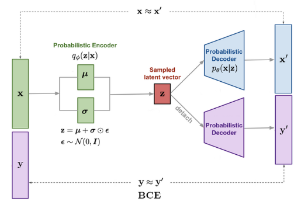
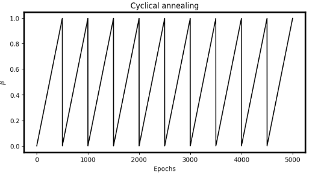

# 8DM20 - CSMIA - Deep-learning

This repository contains a PyTorch implementation used for the Capita Selecta in Medical Imaging Analysis project, hosted by University of Technology Eindhoven. The objective is to segment the prostate in MR images. To this end, we train a Variational Auto-Encoder to generate synthetic prostate images along with its corresponding binary mask. The generated segmentations are then used to improve the U-Net segmentation model. The workflow and usage of our method is described below. 
## Group 6

* Olga Capmany Dalmas
* Paula Del Popolo
* Zahra Farshidrokh
* Daniel Le
* Jelle van der Pas
* Marcus Vroemen

## Quick usage
```
See main.py
```
## Dependencies

* Python==3.10.9 (may work with other versions)
* matplotlib==3.8.2
* numpy==1.25.2
* SimpleITK==2.3.1
* SimpleITK==2.3.1
* torch==2.0.1+cu117
* torchvision==0.15.2+cu117
* tqdm==4.66.2

```bash
pip install -r requirements.txt
```
## Folder Structure
Because the `TrainingData` folder is used for this part as well as the registration part it should be located in the parent directory (directory above working directory).
```
ProstateSegmentation
├───main.py - main script 
├───train.py - holds training class
├───utils.py - contains utility methods, logger
├───config.json - holds configuration settings
│
├───models
│   ├───u_net.py 
│   └───vae.py 
│
├───segmentation_results
│   └───%Y%m%d_%H%M%S - contains segmentation weights and plots
│   
└───vae_results
    └───%Y%m%d_%H%M%S - contains data generation weights and plots

```

## Config file 
The config file is in `.json` file format and contains parameters used for data loading and training.

```JSON
{
    "dataloader": {
        "data_dir": "TrainingData",       // Foldername data (IN PARENT DIR!)
        "validation_patients": 2,         // Validation subset size
        "image_size": [64, 64],           // Training image dimensions
        "batch_size": 32,                 // Batch size
        "nr_synthetic_imgs": 34,          // Number of synthetic images
        "z_dim": 256,                     // Latent space dimension
        "device": "cuda"                  // Computation device
    },
        
    "train": {
        "device": "cuda",                 // Computation device
        "epochs": 250,                    // Number of epochs
        "lr_vae": 0.0005,                 // Learning rate VAE
        "lr_unet": 0.0001,                // Learning rate U-Net
        "decay_lr_after": 200,            // Lambda decay after epoch #
        "z_dim": 256                      // Latent space dimension
    }
}
```
## Workflow
### Generation of masks
To generate corresponding segmentation masks the original VAE implementation is extended. A secondary decoder is introduced which learns to generate the segmentation mask, given the same set of latent variables to reconstruct the image. A binary cross entropy loss function is used to optimize this decoder. The decoder is also detached from the computational graph of the model to avoid double backpropagation. 

### Improving quality VAE
To improve the quality of images, we decompose the VAE loss function into the reconstruction loss term and KL divergence loss term. To explore different behaviours of the loss function, the $\beta$-VAE introduces a hyperparameter, which is a multiplier on the KL divergence loss term. The idea is to have different constraints for different values of beta, i.e., $\beta<1$ puts more weight on the reconstruction loss term relative to the KLD, and could potentially lead to sharper images. On the contrast, $\beta>1$ puts more weight on minimizing the distance between the approximated posterior and prior distribution, and could lead to an increase in disentanglement. 

=-%5Cmathbb%7BE%7D_%7B%5Cmathbf%7Bz%7D%5Csim%20q_%5Cphi(%5Cmathbf%7Bz%7D%5Cvert%5Cmathbf%7Bx%7D)%7D%5Clog%20p_%5Ctheta(%5Cmathbf%7Bx%7D%5Cvert%5Cmathbf%7Bz%7D)&plus;%5Cbeta%20D_%5Ctext%7BKL%7D(q_%5Cphi(%5Cmathbf%7Bz%7D%5Cvert%5Cmathbf%7Bx%7D)%5C%7Cp_%5Ctheta(%5Cmathbf%7Bz%7D)))

### Training VAE
Three models are trained with the following parameters:
- $\beta = 1$ 
- $\beta$ cyclical linearly increasing between 0 and 1
- $\beta = 5$



## Training U-Net
Segmentation metrics are evaluated for U-Net model with an extended dataset using the VAE models. Quantitative results are shown below. We evaluate 1:1 ratio as well as 1:2.

|Model	                 |HD↓              |HD95↓            |DSC↑             |
|------------------------|-----------------|---------------- |-----------------|
|No aug                  | 3.57 $\pm$ 1.07 | 2.72 $\pm$ 0.94 | 0.75 $\pm$ 0.08 |
|$\beta=1$ **(1:1)**         | **2.14** $\pm$ **0.42** | **1.34** $\pm$ **0.32** | **0.86** $\pm$ **0.03** |
|$\beta=1$ (1:2)         | 2.36 $\pm$ 0.69 | 1.41 $\pm$ 0.58 | 0.86 $\pm$ 0.04 |
|$\beta_{cyclical}$ (1:1)| 4.31 $\pm$ 1.29 | 3.49 $\pm$ 1.23 | 0.72 $\pm$ 0.05 |
|$\beta_{cyclical}$ (1:2)| 3.51 $\pm$ 0.53 | 2.38 $\pm$ 0.28 | 0.76 $\pm$ 0.05 |
|$\beta=5$ (1:1)         | 4.86 $\pm$ 1.06 | 3.96 $\pm$ 0.88 | 0.64 $\pm$ 0.07 |
|$\beta=5$ (1:2)         | 4.32 $\pm$ 1.02 | 3.33 $\pm$ 0.81 | 0.71 $\pm$ 0.03 |